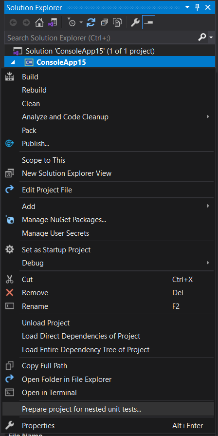
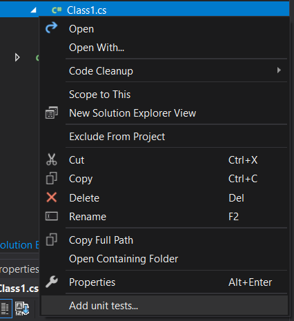
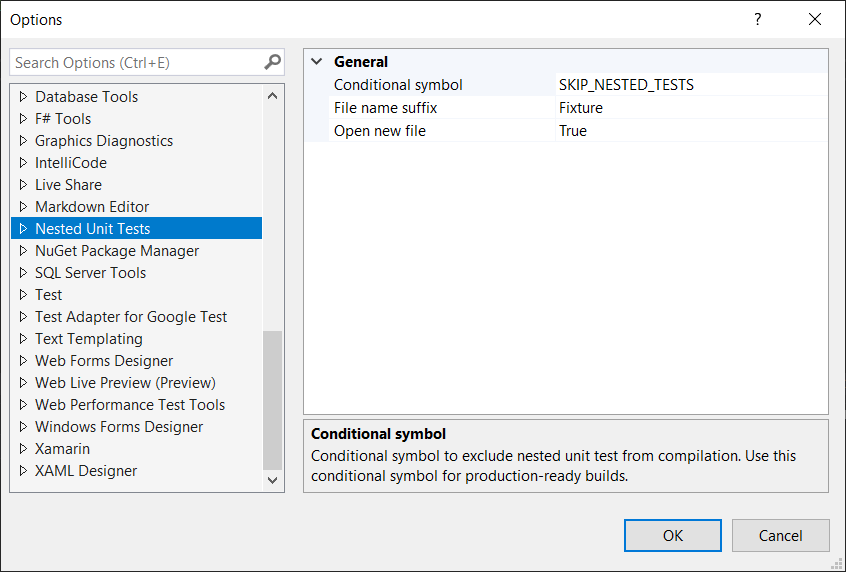

# Nested Unit Tests Visual Studio Extension

What's about to move your unit tests closer to the code?

## How to try

- Create a new class library for netcore or net5/6 (with SDK style csproj)
- Click RMB on project node in Solution Explorer and choose [Prepare project for nested unit tests](1.png)
- Click RMB on C# file node in Solution Explorer and choose [Add unit tests](2.png)
- New C# file with the unit test can now be opened under the [file you choosed](3.png).

[You can also set this Vsix up](4.png)

To exclude you tests from compilation for production use the following construction `dotnet build /p:DefineConstants=SKIP_NESTED_TESTS`.

This is a very early version of the vsix! You can download it for Visual Studio 2019 [here](https://marketplace.visualstudio.com/items?itemName=lsoft.NestedUnitTests).

## Screenshots

